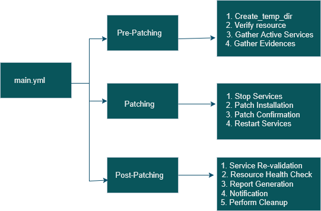

# Automate PatchingUsing Ansible 
### Problem statement 
Managing operating system patching across multiple Linux servers is time-consuming, error-prone, and inconsistent when performed manually. System administrators often need to log in to each server, clean package caches, install updates, reboot systems, and validate health — a process that becomes difficult to track and standardize across environments

### Objective of the project
- Standardizes the patching process across all Linux servers
- Reduces manual effort and human error
- Ensures timely installation of security and OS updates
- Provides a safe and controlled patching workflow
- Handles reboots intelligently
- Improves reliability and consistency
- Allows easy scaling
- Enables future enhancements

### Description
A complete Ansible automation solution for patching Linux servers across multiple environments. This project uses modular Ansible roles to clean package caches, install security and enhancement updates, handle reboots, and perform post-validation checks. It reduces manual effort, ensures consistent patch cycles, and provides safe, repeatable system updates for enterprise infrastructure.  
It is design to: 
- Reduce manual patching time
- Standardize updates across environments
- Automatically handle reboots
- Provide clear logs and patching results
- Support RedHat-based and Debian-based Linux distributions

### Key Feature 
- Automated package cache cleaning
- OS update installation (security + enhancement patches)
- Safe reboot handling
- Pre-checks & post-checks
- Role-based structure for reusability
- Customizable via variables

### Folder Structure 
```
Automate_Patching_Using_Ansible/
|
|- Patching.yml
|- README
|- Flowdiagram.png
|- roles/
    |- Pre-Patching/
         |- tasks/
             |- Create_temp_dir.yml
             |- Disk_Space_info.yml
             |- dns_info.yml
             |- Gather_Active_Services.yml
             |- Gather_Evidence.yml
             |- Os_Release_Info.yml
             |- uptime_info.yml
             |- Verify_resiurces.yml
             |- main.yml
         |- vars/
             |- main.yml
    |- Patching/
         |- tasks/
             |- Debian_Patch_Installation.yml
             |- RedHat_Patch_Installation.yml
             |- reboot.yml
             |- Patch_Confirmation.yml
             |- Restart_Services.yml
             |- Stop_Services.yml
             |- main.yml
         |- vars/
             |- main.yml
    |- Post-Patching/
         |- taska/
             |- Resource_HealthCheck.yml
             |- service_revalidation.yml
             |- service_diff.yml
             |- report_generation.yml
             |- cleanup.yml
             |- main.yml
         |- vars/
             |- main.yml
```
### Flow diagram 

### What is Patching 
 Patching is the process of applying updates to a system’s operating system, applications, or software components to fix issues, improve performance, enhance security, and add new features.
These updates are called patches.
### Prerequisities
1. Install Ansible 
```
pip install ansible 
```
2. Ensure SSH access
3. Ensure Sudo Privileges
### How to Run 
Command to run the playbbok
```
ansible-playbook Patching.yml
```
To create a role 
``` 
ansible-galaxy init <Role-name> 
```
### Variable 
You can store variable
### Variables Used in This Project
# 📑 Variables Used in This Project

| Variable Name      | Type     | Default Value / Example                                           | Used In Role         | Description |
|-------------------|---------|------------------------------------------------------------------|--------------------|-------------|
| Pre_Patching       | String  | "/home/tanisha/Ansible_Patching_Playbook"                        | Pre-Patching, Post-Patching | Path to the Ansible patching playbook for pre-patching tasks. |
| Patching_dir       | String  | "/home/tanisha/Ansible_Patching_Playbook"                        | Patching           | Path to the Ansible patching playbook for main patching tasks. |
| Patching_stage     | String  | "/home/tanisha/Ansible_Patching_Playbook"                        | Post-Patching      | Path to the Ansible patching playbook for post-patching tasks. |
| timestamp          | String  | "{{ lookup('pipe', 'date -d \"minutes\" +\"%Y%m%d %r\"') }}" | All roles          | Timestamp generated dynamically for logging or tracking patch execution. |
| stage_dir          | String  | "Pre_Patching"                                                   | Pre-Patching, Post-Patching | Directory name for staging files during pre-patching or post-patching. |
| stage_dir1         | String  | "Patching"                                                       | Patching           | Directory name for staging files during the main patching process. |
| stage_dir2         | String  | "Post_Patching"                                                  | Post-Patching      | Directory name for staging files during post-patching tasks. |
| items              | List    | ["apache2", "nginx", "httpd", "mysql"]                           | Patching, Post-Patching | List of services/packages to be checked or patched. |
| notification       | Boolean | false                                                            | Post-Patching      | If `true`, sends email notification after patching is complete. |
```
Note  
timestamp is dynamically generated in each role to track execution.

stage_dir, stage_dir1, stage_dir2 are used to separate directories for pre, main, and post-patching stages.

items lists services/packages targeted by patching tasks.

notification controls email alerts and is only used in the Post-Patching role.
````
### Contributing 
```
Pull requests are welcome. For major changes, please open an issue first to discuss what you would like to change.
````